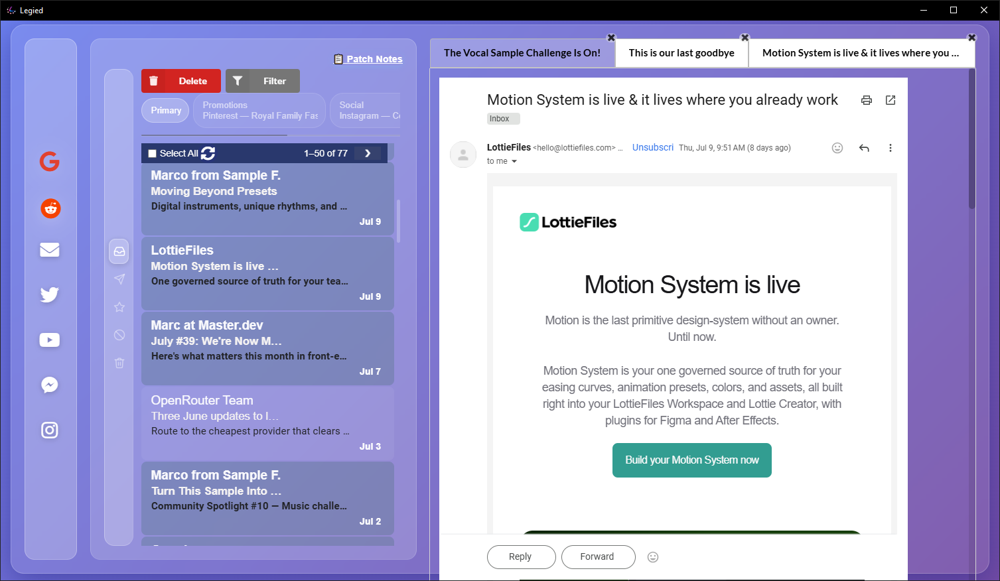
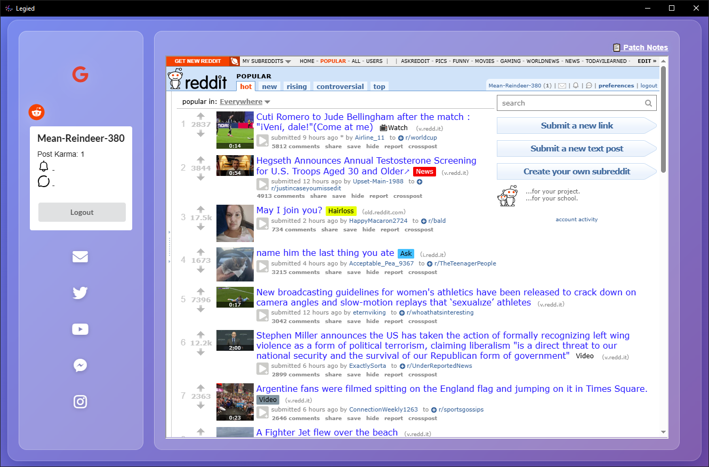
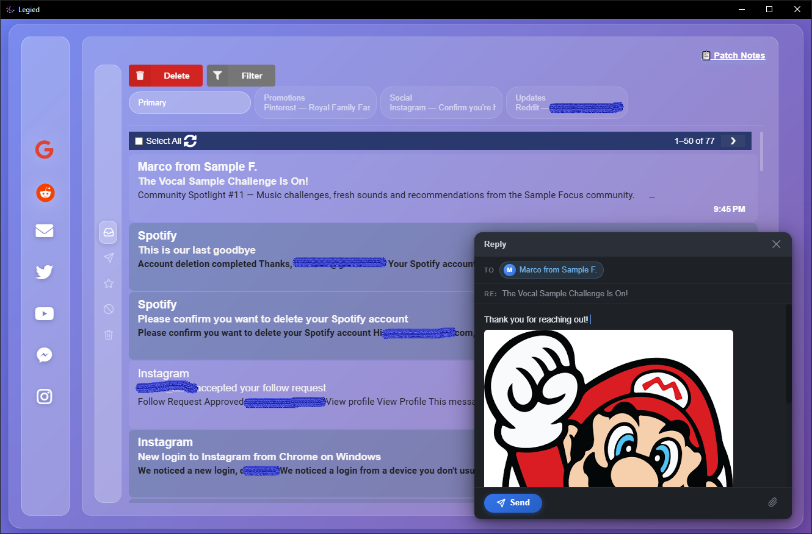
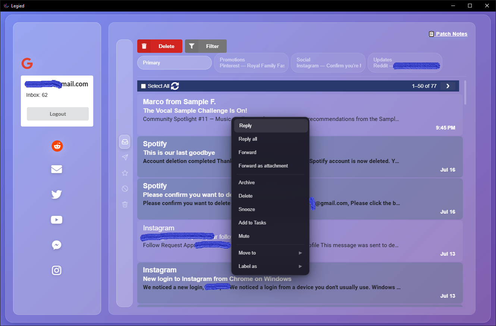

# Legied

<b>All apps in one place with dreamed customizations.</b>

## Make your apps work the way you want
 The one and only problem when using any app prolly will be the much stuffs you can see that it doesn't relate to what you actually want like ads! also the inability to customize your app its interface, and the way it interacts, Legied will mainly combine all your apps in one app and give the ability to customize how things should work and be viewed which grab features that doesn't exist in the main app. 

---
> [!IMPORTANT]
 The app on it's first release still, there's a lot of features that needs to be add, the best way to find out what should come next is what i added on the first release which includes Gmail and Reddit, and i'll be waiting for the feedbacks and list what should come next in the upcoming releases. 

## In app images

